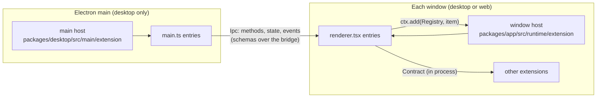
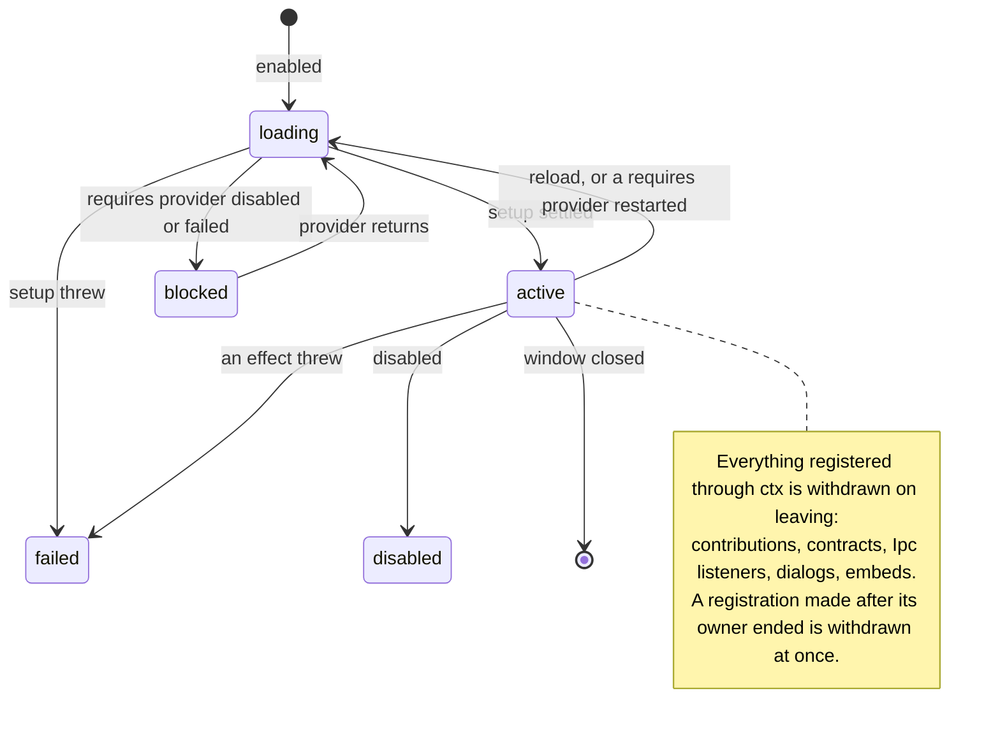
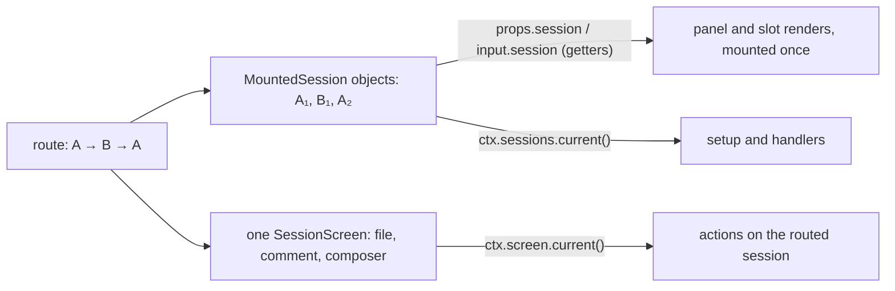
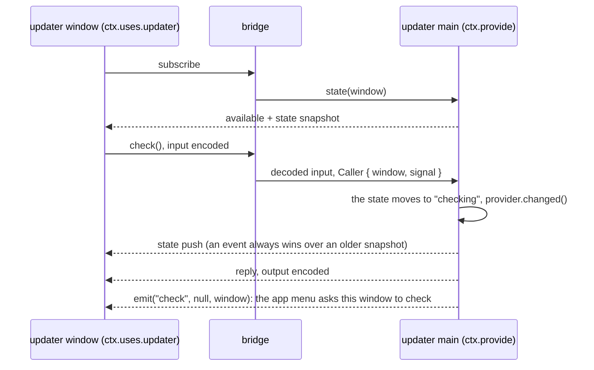

# GUI extensions

Every feature of the desktop and web app that is not the core shell is an extension: the terminal, review, files, the browser, SSH, WSL, the updater and more. Each one builds only on the SDK in [`src/sdk`](src/sdk). The SDK is typed so that the common bugs fail to compile or fail the lint, and every declaration has TSDoc, so editor hovers answer most questions. This guide shows how the parts fit, with code from the extensions that ship. [Build your first extension](#build-your-first-extension) walks through [`src/pairing`](src/pairing), a small built-in that uses both processes. `bun run lint` checks every code block marked with its source against that source.

- Window SDK: `@opencode/gui-extensions/sdk` ([`index.ts`](src/sdk/index.ts))
- Main-process SDK: `@opencode/gui-extensions/sdk/main` ([`main.ts`](src/sdk/main.ts))
- Rules for agents: [`AGENTS.md`](AGENTS.md)



## Anatomy

```text
src/pairing/
├── index.ts          Extension.define: id, provides, uses, requires, stores, i18n
├── contract.ts       tokens other code may import: Ipc, Contract, Registry
├── renderer.tsx      window entry, default export Setup<typeof definition>
├── main.ts           main entry, default export MainSetup<typeof definition> (desktop only)
├── page.tsx          heavy UI, loaded with lazy()
└── i18n/en.ts        English copy; other locales load when picked
```

Unit tests of logic that carries a contract sit beside the code as `*.test.ts`, as in `src/ssh/` and `src/updater/`.

`Extension.define` is the manifest. The host reads it before any entry loads.

| Field      | What it declares                                                              | In the context                                    |
| ---------- | ----------------------------------------------------------------------------- | ------------------------------------------------- |
| `id`       | Prefix of every id: commands, panel keys, stored keys, contract and Ipc ids   | `ctx.id`                                          |
| `legacy`   | Earlier extension ids, newest first; preserves desktop enable state after a rename |                                                   |
| `os`       | The operating systems it runs on; omit it to run everywhere, the web included |                                                   |
| `provides` | Contracts from the window entry, Ipcs from the main entry                     | `ctx.provide(token, impl)`, and `ctx.uses.name()` |
| `uses`     | Optional dependencies other extensions provide; it works while one is missing | `ctx.uses.name()` is `Live<T>`                    |
| `requires` | Hard dependencies; setup runs only while all are active                       | `ctx.requires.name` is `T`                        |
| `stores`   | State the host stores: window stores load before they are read, main's always | `ctx.stores.name`, each process its own           |
| `i18n`     | The extension's copy                                                          | `ctx.t`, `ctx.plural`                             |

- [`src/renderer.ts`](src/renderer.ts) and [`src/main.ts`](src/main.ts) list the built-ins, each through `Extension.compose`. These are the only files that name extensions.
- Another extension imports only your `contract.ts`.
- A window entry loads with the app. Keep it small and put heavy UI behind `lazy()`.

## The context

Setup receives one context. Components read the same object with `useExtension<typeof definition>()`.

| Member                   | Window                                                                                      | Main                                   |
| ------------------------ | ------------------------------------------------------------------------------------------- | -------------------------------------- |
| Host APIs                | `ctx.layout`, `ctx.sessions`, `ctx.storage`, `ctx.desktop`, … (see the [catalog](#catalog)) | `ctx.storage`, `ctx.windows`, …        |
| Optional dependencies    | `ctx.uses.name`: `Accessor<Live<T>>`, `provides` included                                   |                                        |
| Hard dependencies        | `ctx.requires.name`: `T`                                                                    |                                        |
| Declared stores          | `ctx.stores.name`: `Persisted`, or `(session) => Persisted`                                 | `ctx.stores.name`: `Persisted`, loaded |
| Contribute to a registry | `ctx.add(Registry, item)`                                                                   | `ctx.add(MenubarItem, item)`           |
| Provide a dependency     | `ctx.provide(Contract, impl)`                                                               | `ctx.provide(Ipc, impl)`               |
| Lifetime                 | Solid's `onCleanup` and `ctx.signal`                                                        | `ctx.scope` (`signal`, `addFinalizer`) |
| Copy                     | `ctx.t(key, params)`, `ctx.plural(key, count)`                                              | the same                               |

- Host APIs are getters: an API you never read costs nothing.
- No host API throws before the app interface mounts: reads return their documented defaults (`ctx.layout.ready()` is false), and writes such as `ctx.layout.open` wait, then apply in call order. A dialog `ctx.dialogs.open` opens meanwhile shows after the interface's first render.
- Registries and contracts are tokens: `ctx.add(Command, …)`, `ctx.provide(FileTree, …)`.
- Reading a token you did not declare is a compile error. A key that names one token in `provides` and another in `uses` is one too.
- Bind each contract component with `bindExtension` during the provider's setup so `useExtension` reads the provider's context, not the consumer's. Props retain their getters. Leave data methods such as `Changes.diffs()` unwrapped.

```tsx
ctx.provide(FileTree, { Tree: bindExtension((props) => <Tree {...props} />) })
```

```ts
const setup: Setup<typeof definition> = (ctx) => {
  const changes = ctx.uses.changes // Accessor<Live<Changes>>
  const prefs = ctx.stores.prefs.value // loaded before setup
  ctx.add(Command, { id: "open", title: ctx.t("open"), run: () => ctx.layout.settings(ctx.id) })
}
```

### Lifetimes



- A registration ends with the current Solid owner: a component, a `createKeyed` run, or else the extension.
- Teardown of other work: `onCleanup` in the window, `ctx.scope.addFinalizer` in main. Setup returns nothing.
- Window setup is synchronous: its `undefined` return type rejects async functions, and the host fails thenable-returning JavaScript setups instead of waiting for them. Put async work in `createKeyed` or `createLatest`, with `ctx.signal` or a signal derived from it. Only main setup may be async. After each `await` there is no owner; return if the signal aborted before registering or changing state. Late registrations remain safe: the host releases them when the owner or instance ended.

The updater listens to its main side's `check` event once per generation of that side. When main restarts, the run ends and its listener goes with it:

<!-- source: src/updater/renderer.tsx#createKeyed -->

```tsx
// Beta builds answer the app menu's Check for Updates in the focused window instead of a native dialog. The
// listener ends with the generation of the main side that sends it.
createKeyed(updater, (client) => void client.on("check", () => act("check")))
```

### The routed session



- Each routed session gets its own frozen `MountedSession`: `key`, `id`, `tab`, `server`, `directory` and `visit` never change on one object, and `location`, `project` and the other fields read that session's data, never the route's. It has nothing that acts on another session.
- A session that moves to another directory gets a new object too, with the new `directory` and the same `key` and `visit`. Key per-session state by `key`.
- Renders stay mounted. The host hands them the next object through a reactive getter, so read `props.session` (panels), `input.session` (slots) or `state.session` (tab labels) where you use it, and never copy it into a variable.
- The workspace files, line comments and composer follow the route, so they belong to the session screen. An action through it targets the session routed at that moment. Read it inside a render or a handler, not once in setup. Key per-screen state, such as cached tab objects, by the screen; key per-session state by `session.key`.
- `ctx.screen.current()` and `ctx.sessions.current()` are published together in one batched effect after the screen's first render, with v2's original session-mount timing. Renders already receive their owning screen and session directly. Both public accessors are undefined during the first render, on Home, on a draft, before the interface mounts and once the route leaves the mounted screen. The screen has no `session` property.
- All panel callbacks take one named input: `list({ session, screen, open })`, `render({ tab, session, screen })`, `focus({ tab, session, screen, restored })`, `close({ tab, session, screen })`, `normalize({ id, session, screen })`. Session fields are getters; the screen is the constant owning screen. Render tab fields are live getters too; lifecycle callbacks receive their event's tab. Stored ids and `restored` describe that call. Do not destructure live getters. Every `session.*` slot gets a non-null `screen`; `window.bottom` does not.
- Render effects can run before public publication too: change-list views call `Changes.watch(input.screen, source)`, not `ctx.screen.current()`, so their first demand is never lost.
- `fallback: true` opts a tab into selection when the stored selection is missing or cannot be selected; false or omission opts out. The host takes the first eligible regular tab, then a `first` tab, then a pinned tab, preserving order within each tier. Closing a tab still selects its neighbour.

```ts
ctx.add(Panel, {
  id: "main",
  region: "side",
  list: (input) => (input.open.includes("main") ? [tab] : []),
  // Runs once; `props.session` returns B's object after a switch to B, without a remount.
  render: (props) => <View session={props.session} screen={props.screen} tab={props.tab} />,
})

// The composer follows the route, so it belongs to the screen: the file reaches the session routed when this runs.
ctx.add(Command, {
  id: "attach-readme",
  title: ctx.t("command.attachReadme"),
  get enabled() {
    return !!ctx.screen.current()
  },
  run: () => ctx.screen.current()?.composer.attach({ type: "file", path: "README.md" }),
})
```

## Primitives

| Primitive                                        | Use it for                                                                          |
| ------------------------------------------------ | ----------------------------------------------------------------------------------- |
| `Extension.define(definition)`                   | The manifest, typed so `Setup<typeof definition>` sees the declarations             |
| `Extension.compose(...definitions)`              | A process's list; rejects repeated extension ids and missing or duplicate providers |
| `Registry.define<T>(id)`                         | A list your extension owns and others contribute to                                 |
| `Contract.define<T, Id>(id)`                     | An in-process API one extension provides to others                                  |
| `Ipc.define(spec)` / `Ipc.ref<typeof T>(id)`     | The main ↔ window contract, or a reference to it that loads no schemas             |
| `Store.global` / `Store.session` / `Store.main`  | Declared window state the host loads before you read it, and main state             |
| `createKeyed(source, fn, { otherwise, equals })` | Side effects per provider generation or per value; the only sanctioned effect       |
| `createLatest(source, fetch)`                    | Async data that never suspends and drops stale replies                              |
| `createVisitState(initial)`                      | State that resets each time the user routes back to the session                     |
| `useExtension` / `usePanel` / `useDrawer`        | The context, the panel frame, and the narrow-screen drawer in components            |
| `bindExtension(component)`                       | One contract component under its provider's context; data methods stay plain        |
| `onIdle(fn)`                                     | Preloading a lazy chunk while the app is idle                                       |
| `Scope` (main)                                   | `ctx.scope`: `signal`, `addFinalizer`, `fork`, `close`                              |

[Lifetimes](#lifetimes) shows `createKeyed` in the updater.

```ts
// Forget a selection when the user goes Home and back.
const [selected, setSelected] = createVisitState<string | undefined>(undefined)

// Compile the settings page while the app idles, not when settings opens.
const Page = lazy(() => import("./page"))
onCleanup(onIdle(() => void Page.preload()))
```

Pairing's shipping page uses a query, not `createLatest`. It passes the query's abort signal directly to the no-input Ipc method; options are the only argument. The generation in the key asks again when main comes back:

<!-- source: src/pairing/page.tsx#screenActive -->

```tsx
const screenActive = useQuery(() => ({
  queryKey: [ctx.id, "screen-active", display()?.generation],
  queryFn: (input) => {
    const live = display()

    if (!live) throw new Error("Pairing's main side is not active")

    return live.value.screenActive({ signal: input.signal })
  },
  enabled: !!display(),
  gcTime: 0,
}))
```

## Catalog

Each line links to the file whose TSDoc covers every field.

SDK icon fields use `IconName` from `@opencode/ui/icons/catalog`, a dependency-free module with no Solid or CSS imports. The UI renderer reads that same catalog: there is no copied name list or dependency on a UI component's props, and no artwork in the general-purpose util package.

### Registries

| Registry                                | Process | What an item is                                                                             |
| --------------------------------------- | ------- | ------------------------------------------------------------------------------------------- |
| [`Command`](src/sdk/registries.ts)      | window  | A palette command with an optional keybind and slash command                                |
| [`MenuItem`](src/sdk/registries.ts)     | window  | An item of a host menu: the side panel + menu, Add server, a server row                     |
| [`Panel`](src/sdk/registries.ts)        | window  | Tabs in the session's side region, or the dock                                              |
| [`SettingsPage`](src/sdk/registries.ts) | window  | A settings page, a section on a host page, or rows in a host section                        |
| [`Server`](src/sdk/registries.ts)       | window  | A source of servers, such as SSH hosts                                                      |
| [`LinkHandler`](src/sdk/registries.ts)  | window  | Opens local links, such as file paths in messages, and says whether their target exists     |
| [`TitlebarItem`](src/sdk/registries.ts) | window  | A titlebar pill, or the dev channel badge as a toggle                                       |
| [`Slot`](src/sdk/registries.ts)         | window  | Content for `window.bottom`, `session.header`, `session.panel.end`, `session.panel.sidebar` |
| [`Style`](src/sdk/registries.ts)        | window  | CSS imported with `?inline`                                                                 |
| [`MenubarItem`](src/sdk/main.ts)        | main    | An item of the native app menu                                                              |

### Host APIs

| Property                     | Type ([window](src/sdk/host-apis.ts), [main](src/sdk/main.ts)) | What it does                                                      |
| ---------------------------- | -------------------------------------------------------------- | ----------------------------------------------------------------- |
| `ctx.layout`                 | `Layout`                                                       | Side panel tabs, the dock, scroll offsets, settings, open project |
| `ctx.sessions`               | `Sessions`                                                     | Sessions of open tabs, and the mounted `MountedSession`           |
| `ctx.screen`                 | `Screen`                                                       | The session screen's files, comments and composer                 |
| `ctx.storage`                | `Storage`                                                      | Stores for keys known only at runtime, and window memory          |
| `ctx.system`                 | `System`                                                       | Clipboard, saving files, `openExternal`                           |
| `ctx.desktop`                | `Desktop \| undefined`                                         | Desktop-only: reveal, launch, installed, zoom, forceFocus         |
| `ctx.dialogs`                | `Dialogs`                                                      | `open` returns a handle to close; a dialog closes with its owner  |
| `ctx.links`                  | `Links`                                                        | Opens a local link, or checks it exists, with the best handler    |
| `ctx.embeds`                 | `Embeds`                                                       | Shows a web page the main entry created                           |
| `ctx.build`                  | `Build`                                                        | Version, channel, platform, packaged                              |
| `ctx.locale`                 | `Locale`                                                       | Locale and writing direction                                      |
| `ctx.appearance`             | `Appearance`                                                   | The user's mono font                                              |
| `ctx.router`                 | `Router`                                                       | The route path, and whether it is changing                        |
| `ctx.keybinds`               | `Keybinds`                                                     | Display and matching of command keybinds                          |
| `ctx.servers`                | `Servers`                                                      | The servers the app lists, and each one's live `ServerRef`        |
| `ctx.workspaces`             | `Workspaces`                                                   | `on("remove", …)` when a workspace is removed                     |
| `ctx.scope` (main)           | `Scope`                                                        | The instance's lifetime                                           |
| `ctx.storage` (main)         | `Storage`                                                      | Synchronous storage, the same `Persisted` shape                   |
| `ctx.log` (main)             | `Log`                                                          | The desktop log file                                              |
| `ctx.lifecycle` (main)       | `Lifecycle`                                                    | `restart(handoff, { keep })`                                      |
| `ctx.build` (main)           | `Build`                                                        | The same shape; `platform` is `"desktop"`                         |
| `ctx.serverEndpoints` (main) | `ServerEndpoints`                                              | URL and credentials of a server the windows use                   |
| `ctx.windows` (main)         | `Windows`                                                      | The app's main windows                                            |
| `ctx.embeds` (main)          | `Embeds`                                                       | `create(view, window)` places a web page                          |
| `ctx.cli` (main)             | `Cli`                                                          | The opencode CLI the app runs                                     |

## Ipc: main ↔ window

An `Ipc` is the typed contract between an extension's main entry and its windows. Its schemas encode every value that crosses the bridge.



- Define it in `contract.ts`. Its id is your extension id, or `<id>.<name>`. A method without an input schema takes only optional call options: `pairing.screenActive({ signal })`, never an `undefined` placeholder.
- Your own Ipc goes in `provides` only: the main entry provides it, and the window entry reads it as `ctx.uses.name`. Another extension's Ipc goes in `uses`.
- On the web there is no main process: the Ipc is always `inactive`.
- `IpcsProvided<typeof renderer, typeof main>` fails to compile when a window provides, uses or requires an Ipc that no main entry provides. [`src/builtins.typecheck.ts`](src/builtins.typecheck.ts) checks the built-ins.
- To name an Ipc without loading its schemas at startup, declare a reference and load the full token from the chunk that needs it:

```ts
// browser/index.ts: a type-only import, so no schemas load at startup
import type { BrowserPane } from "./ipc"
const Pane = Ipc.ref<typeof BrowserPane>("browser.pane")
export default Extension.define({ id: "browser", provides: { pane: Pane } })

// browser/model.ts: a chunk that loads with the first session and imports the full token
const pane = ctx.uses.pane.load(BrowserPane) // pending until this runs, here and in other extensions
```

A reference cannot go in `requires`: setup would wait for a `load` that only setup can make.

## Live and failure handling

`ctx.uses.name()` returns `Live<T>`, one object per provider transition.

| Status                     | When                                                                     | What the user must see                       |
| -------------------------- | ------------------------------------------------------------------------ | -------------------------------------------- |
| `pending`                  | The provider has not started, e.g. main is not up yet                    | A loading state, or nothing to click         |
| `active`                   | `value` is the contract or client; `generation` counts restarts          | The feature                                  |
| `inactive`, `"restarting"` | It was active and comes back                                             | Keep what the user had; resume after         |
| `inactive`, `"disabled"`   | Turned off, not composed, or not on this platform (every Ipc on the web) | An unavailable state, never a dead button    |
| `inactive`, `"failed"`     | Its setup threw                                                          | An unavailable state                         |
| `inactive`, `"blocked"`    | A hard dependency is disabled, failed or itself blocked                  | An unavailable state; resume when it returns |

- Offer an action only while it can answer, or let it answer with an unavailable state. Never a silent `return`, never an endless spinner.
- `createKeyed` runs once per active generation. What the run registers ends with that generation. `otherwise` runs while there is none.
- An Ipc that goes away is a suspension, not a failure: keep what the user had and resume when it returns. No retry timer.
- An Ipc call can reject while the event that explains it is still in flight. When main reports an outcome as an event, let the event decide.
- A contribution that throws renders nothing and records the error. The rest of the window keeps working.

The updater's actions branch on the `Live` value and still answer while its main side is missing:

<!-- source: src/updater/renderer.tsx#act -->

```tsx
const act = (name: "check" | "install") => {
  const live = updater()

  if (live.status === "active") return void import("./actions").then((module) => module[name](ctx, live.value))

  // Not loaded yet, or gone (disabled, failed, blocked, restarting): nothing can check or install.
  showToast({ title: ctx.t("common.requestFailed") })
}
```

The pairing settings page waits for its main side only where it needs it. The link and QR code come from the local server's `ServerRef`, so they render without main; the display setting renders only while main is active, so it never offers a switch that cannot answer:

<!-- source: src/pairing/page.tsx#display -->

```tsx
// Only the display setting needs pairing's main side; the link and QR code come from the server, so they never wait.
const display = () => {
  const live = props.pairing()

  return live.status === "active" ? live : undefined
}
```

## Stored state

Desktop windows load storage over IPC; the web reads it synchronously. A read before load passes every web test and still breaks desktop, so declare your stores.

| Kind                                    | Value                                                           | Loads                         |
| --------------------------------------- | --------------------------------------------------------------- | ----------------------------- |
| `Store.global(schema, initial, from?)`  | window `ctx.stores.name.value`: never undefined                 | Before setup                  |
| `Store.session(schema, initial, from?)` | window `ctx.stores.name(session).value`: undefined until loaded | When the session mounts       |
| `Store.main(schema, initial, from?)`    | main `ctx.stores.name.value`: always defined                    | Synchronously                 |
| `ctx.storage.store(key, options)`       | window `value`: undefined until loaded                          | When opened; for runtime keys |
| main `ctx.storage.store(key, options)`  | `value`: always defined                                         | Synchronously; runtime keys   |

Each process's `ctx.stores` holds only its own stores: reading a `Store.main` store in the window, or a window store in main, fails to compile.

Details lists older homes, newest first: its earlier id's namespace, then the app key before it.

<!-- source: src/details/index.ts#prefs -->

```ts
// Stored under the extension's earlier id `summary`, and before extensions in the app settings.
prefs: Store.global(Prefs, { projectExpanded: true, serverExpanded: true }, [
  "extension.summary.prefs",
  { key: "settings.v3", pick: (value: { sessionSummary?: unknown } | null) => value?.sessionSummary },
]),
```

Review imports one session's slice of an app key that holds every session:

<!-- source: src/review/index.ts#session -->

```ts
// The mode, selected file and open files of each session.
session: Store.session(
  SessionState,
  { open: [] },
  {
    key: "layout",
    sessions: "sessionView",
    // An entry that holds only other fields, such as its scroll, holds no review state.
    pick: (entry: { reviewMode?: unknown; reviewFile?: unknown; reviewOpen?: unknown } | undefined) =>
      entry && [entry.reviewMode, entry.reviewFile, entry.reviewOpen].some((field) => field !== undefined)
        ? { mode: entry.reviewMode, file: entry.reviewFile, open: entry.reviewOpen }
        : undefined,
  },
),
```

SSH keeps a main store, imported from a key of the desktop settings file. `{ state: [namespace, key] }` names a key of another main storage namespace instead, and `file` another settings file:

<!-- source: src/ssh/index.ts#servers -->

```ts
// The saved hosts, which main keeps; stored before in the desktop settings file.
servers: Store.main(Schema.Array(SshConfig), [], { settings: "ssh.servers" }),
```

- Keys live in your namespace: `extension.<id>.<name>` in the window, the store's name under `extension.<id>` in main.
- `from` imports an older value once, while the store holds none. A list names older homes, newest first. With `pick`, the older key stays for its other owners; a pick returns undefined when that key holds none of its fields, never an object of undefined fields, so the next home is read.
- `update(mutate)` edits a deep-mutable draft and must return nothing or `undefined`. Returning the next value is a compile error and throws at runtime in both processes; use `set(next)` to replace the complete value, including main primitives and lists. Plain `Schema.Struct` fields work without `mutableKey`. Window calls wait for load and apply in call order with each other; main writes reach disk immediately. Runtime-key stores have the same contract.
- `Storage.remove(key, { from })` reads as `initial` again and never imports `from` again.
- Renaming an extension moves four things: enable state (`Definition.legacy`), stored keys (`from`), command ids (the keybind rename map in `packages/app/src/settings/keybinds/migration.ts`), and panel keys (`Panel.legacy`). Never drop user data.

Declare earlier ids newest first, for example `Extension.define({ id: "details", legacy: ["summary"] })`. The current id's explicit enable setting always wins. Without one, the first earlier id with a setting wins; with no setting at all, the extension is enabled. Both desktop hosts use this rule. Old rows stay intact, and enable/disable changes write only under the current id. A failed startup snapshot is unknown, so the window waits for the manager list rather than running disabled extensions.

The enable preference is separate from activation: an enabled extension with an unavailable hard dependency is `blocked`. The window publishes disabled providers before starting enabled entries, so consumers settle as blocked regardless of declaration order.

<!-- source: src/details/index.ts#legacy -->

```ts
legacy: ["summary"],
```

## Runtime rules

- **Derive, don't sync.** A value computed from other state is a `createMemo` or a plain function. Never an effect that calls a setter.
- **Effects only for external sync.** `createKeyed` syncs with something outside Solid: the DOM, a widget, an embed, an Ipc subscription. Logic a user action causes goes in the handler.
- **Key an object source by its fields.** A `createKeyed` source that builds an object, such as `{ directory, tab }`, is a new key on every read. Pass `equals` to compare the fields that should run it again.
- **The lint bans raw effects.** `createEffect`, `createRenderEffect` and `createComputed` may not be imported outside `src/sdk`. An escape hatch needs an `oxlint-disable` comment with a reason.
- **Suspense only on first load.** Wrap each `lazy()` component in its own `<Suspense>`, read async data through `.latest` or `createLatest`, and never read a refetching resource in render: it blanks the nearest boundary.
- **Stable objects.** Return the same object from `Panel.list` and reactive contributions while nothing changed, so the host never remounts.
- **No timeline work.** `session.header` is the only timeline surface.
- **No module state.** Keep state inside setup; module state survives a reload and leaks across windows.

## Testing

| Gate                       | Where                                                                                                            | Catches                                                                                                                                     |
| -------------------------- | ---------------------------------------------------------------------------------------------------------------- | ------------------------------------------------------------------------------------------------------------------------------------------- |
| Composition compile checks | [`sdk/compose.typecheck.ts`](src/sdk/compose.typecheck.ts), [`builtins.typecheck.ts`](src/builtins.typecheck.ts) | Duplicate extension ids, missing or duplicate providers, wrong-process stores, readonly drafts, panel and slot inputs, no-input Ipc options |
| Registry compile checks    | [`sdk/registries.typecheck.ts`](src/sdk/registries.typecheck.ts)                                                 | A `MenuItem` field its menu ignores                                                                                                         |
| Graph matrix               | `packages/app/component-tests/extension-graph.spec.ts`                                                           | A `requires` cycle; a consumer that fails when one optional provider is disabled                                                            |
| Keeper suites              | `packages/app/e2e/regression/`                                                                                   | What the user sees, per product area                                                                                                        |
| Unit tests                 | `*.test.ts` beside the code                                                                                      | Pure logic with a contract: paths, migrations, protocols                                                                                    |
| Lint gate                  | `bun run lint` (oxlint, ast-grep, `script/sdk-docs.ts`); `bun run lint:changed`                                  | Raw effects, app imports, module state, undocumented SDK, a guide block that differs from its shipping source                               |

- Test a main entry through its `Ipc` contract with real inputs, not Electron mocks.
- The hosts own their contracts: main storage in `packages/desktop/src/main/extension/storage.test.ts`, the real window host in `packages/app/component-tests/extension-host.spec.ts`. An extension does not test them again.
- Drive the race the user hits: a reload during async work, a store that loads late, an Ipc that goes away and returns.

## Build your first extension

Pairing shows another device how to reach this machine's server, and keeps the display awake. It is small and uses both processes: a main entry that owns a power-save blocker, and a window entry that adds a settings page and a command. The window asks the local server for its addresses and pairing codes through `ctx.servers`: that server's `ServerRef` is already authenticated in the window, so its credentials never leave main. Each block below is its shipping source.

1. **Define the contract.** `contract.ts` holds the tokens other code may import, here the Ipc between pairing's main and window entries. It carries only what needs the main process, the display sleep blocker. The schemas type both sides and encode every value.

<!-- source: src/pairing/contract.ts -->

```ts
import { Schema } from "effect"
import { Ipc } from "../sdk"

/**
 * Keeps this machine's display awake while another device uses it. The window asks the local server for addresses and
 * pairing codes through its own `ServerRef`; only the display sleep blocker needs the main process.
 */
export const Pairing = Ipc.define({
  id: "pairing",
  methods: {
    /** Whether main holds the display sleep blocker. */
    screenActive: { output: Schema.Boolean },
    /** Holds or releases the display sleep blocker, and remembers the choice. */
    setScreenActive: { input: Schema.Boolean },
  },
})
```

2. **Write the definition.** Pairing provides its Ipc, so its window entry reads it as `ctx.uses.pairing` with no second declaration. Whether main keeps the display awake is a main store, imported once from the key the desktop kept it under before. The addresses pairing links use are a window store, which the settings page reads.

<!-- source: src/pairing/index.ts -->

```ts
import { Schema } from "effect"
import { Extension, Store } from "../sdk"
import { Pairing } from "./contract"
import en from "./i18n/en"

export default Extension.define({
  id: "pairing",
  provides: { pairing: Pairing },
  stores: {
    // Whether main keeps the display awake; stored before in the desktop's own settings namespace.
    keepScreenActive: Store.main(Schema.Boolean, false, { state: ["opencode.settings", "keepScreenActive"] }),
    // An address of this computer the server cannot see (a VPN, tunnel or proxy), and the address links use.
    links: Store.global(Schema.Struct({ custom: Schema.String, selected: Schema.String }), { custom: "", selected: "" }),
  },
  i18n: { en },
})
```

3. **Provide it from main.** `MainSetup<typeof definition>` types `ctx.stores`, which main reads synchronously. A finalizer releases the blocker when the instance goes away.

<!-- source: src/pairing/main.ts -->

```ts
import { powerSaveBlocker } from "electron"
import type { MainSetup } from "../sdk/main"
import { Pairing } from "./contract"
import type definition from "./index"

/** The display sleep blocker this instance holds, if any. */
type Blocker = { id?: number }

const setup: MainSetup<typeof definition> = (ctx) => {
  const stored = ctx.stores.keepScreenActive
  const blocker: Blocker = {}

  const release = () => {
    if (blocker.id === undefined) return
    powerSaveBlocker.stop(blocker.id)
    blocker.id = undefined
  }

  const keepScreenActive = (enabled: boolean) => {
    if (enabled && blocker.id === undefined) blocker.id = powerSaveBlocker.start("prevent-display-sleep")

    if (!enabled) release()
    stored.set(enabled)
  }

  if (stored.value) keepScreenActive(true)
  ctx.scope.addFinalizer(release)

  ctx.provide(Pairing, {
    screenActive: () => blocker.id !== undefined && powerSaveBlocker.isStarted(blocker.id),
    setScreenActive: (enabled) => keepScreenActive(enabled),
  })
}

export default setup
```

4. **Write the window entry.** Pairing exists only on desktop, so setup returns at once on the web. The settings page is heavy, so it loads behind `lazy()` and compiles while the app idles; its search entries are indexed without mounting it. The page receives the desktop's own server, found through `ctx.servers` by `builtin`, and `ctx.uses.pairing`. The search entry for the display setting, like the setting itself, exists only while main answers (see `display` under [Live and failure handling](#live-and-failure-handling)).

<!-- source: src/pairing/renderer.tsx -->

```tsx
import { lazy, onCleanup, Suspense } from "solid-js"
import { onIdle, Command, SettingsPage, type Setup } from "../sdk"
import type definition from "./index"

const setup: Setup<typeof definition> = (ctx) => {
  if (!ctx.desktop) return
  const layout = ctx.layout
  const servers = ctx.servers
  const pairing = ctx.uses.pairing
  const Page = lazy(() => import("./page"))
  // Settings rows are small; load them while idle so settings opens without a blank row.
  onCleanup(onIdle(() => void Page.preload()))

  // The desktop's own server. Its ref is already authenticated in this window, so codes need no main process.
  const local = () =>
    servers
      .list()
      .map((id) => servers.get(id))
      .find((server) => server?.builtin)

  ctx.add(SettingsPage, {
    id: "pairing",
    icon: "server",
    available: "desktop",
    get title() {
      return ctx.t("title")
    },
    get entries() {
      const pairingEntry = { id: "pairing", title: ctx.t("title"), keywords: "pair device qr local" }

      // The display setting exists only while pairing's main side answers.
      if (pairing().status !== "active") return [pairingEntry]

      return [
        pairingEntry,
        {
          id: "settings-keep-screen-active",
          title: ctx.t("screenActive.title"),
          description: ctx.t("screenActive.description"),
          keywords: "display sleep awake local",
        },
      ]
    },
    render: () => (
      <Suspense>
        <Page server={local} pairing={pairing} />
      </Suspense>
    ),
  })

  ctx.add(Command, {
    id: "open",
    get title() {
      return ctx.t("command.title")
    },
    get group() {
      return ctx.t("command.category.server")
    },
    run: () => layout.settings("pairing"),
  })
}

export default setup
```

5. **Register it.** A built-in joins both lists, each composed with `Extension.compose`. The main list names every built-in, so their ids stay reserved, and adds pairing's main entry:

<!-- source: src/main.ts#builtins -->

```ts
/**
 * Built-in extensions with their main entries. Lists every built-in so their ids stay reserved. `builtins.typecheck.ts`
 * checks that it provides every Ipc the renderer composition uses.
 */
export const builtins = Extension.compose(
  context,
  btw,
  debug,
  terminal,
  file,
  review,
  details,
  { ...browser, main: () => import("./browser/main") },
  { ...pairing, main: () => import("./pairing/main") },
  { ...updater, main: () => import("./updater/main") },
  { ...ssh, main: () => import("./ssh/main") },
  { ...wsl, main: () => import("./wsl/main") },
  microsoftOffice,
)
```

The window list adds each window entry, loaded with the app:

<!-- source: src/renderer.ts#builtins -->

```ts
/**
 * Built-in extensions with their renderer entries. The only place host builds name extensions. `builtins.typecheck.ts`
 * checks this composition against the main one.
 */
export const builtins = Extension.compose(
  { ...context, renderer: eager(contextRenderer) },
  { ...btw, renderer: eager(btwRenderer) },
  { ...debug, renderer: eager(debugRenderer) },
  { ...terminal, renderer: eager(terminalRenderer) },
  { ...file, renderer: eager(fileRenderer) },
  { ...review, renderer: eager(reviewRenderer) },
  { ...details, renderer: eager(detailsRenderer) },
  { ...browser, renderer: eager(browserRenderer) },
  { ...pairing, renderer: eager(pairingRenderer) },
  { ...updater, renderer: eager(updaterRenderer) },
  { ...ssh, renderer: eager(sshRenderer) },
  { ...wsl, renderer: eager(wslRenderer) },
  { ...microsoftOffice, renderer: eager(microsoftOfficeRenderer) },
)
```

`IpcsProvided` checks the two lists against each other. Drop pairing's `main` entry and this line fails to compile, naming `pairing`:

<!-- source: src/builtins.typecheck.ts#ipcs -->

```ts
export const ipcs: IpcsProvided<typeof builtins, typeof mainBuiltins> = true
```

Your own extension takes the same steps:

1. **Pick the id.** It prefixes your commands, panel keys, stored keys and Ipc ids. A later rename needs the migrations under [Stored state](#stored-state).
2. **Define it.** Create `src/<id>/index.ts` with `Extension.define({ id, i18n: { en } })`, and `src/<id>/i18n/en.ts` with your copy.
3. **Declare the tokens.** Put any token another extension or your main entry needs in `contract.ts`: a `Contract`, a `Registry` or an `Ipc`. Your own tokens go in `provides`. What others provide goes in `uses`, or in `requires` only if the extension is meaningless without it.
4. **Write the window entry.** In `renderer.tsx`, a `Setup<typeof definition>` contributes with `ctx.add`, branches each action on `ctx.uses.<name>()`, runs side work in `createKeyed`, and keeps heavy UI behind `lazy()` with an `onIdle` preload.
5. **Write the main entry, if you need Node or Electron.** In `main.ts`, a `MainSetup<typeof definition>` provides your Ipc with `ctx.provide` and tears down with `ctx.scope.addFinalizer`.
6. **Declare your state.** Use `Store.global`, `Store.session` or `Store.main`, with a `from` for every older home of the value.
7. **Register both entries** in `src/renderer.ts` and `src/main.ts`, as above. The graph matrix then boots each new optional edge with its provider disabled.
8. **Test it.** Unit-test pure logic beside the code. Prove what the user sees with a case in the area's keeper suite in `packages/app/e2e/regression/`.
9. **Check it.** Run `bun run lint`, which includes `script/sdk-docs.ts`, then `bun run lint:changed`, and `bun typecheck` in `packages/gui-extensions`.
